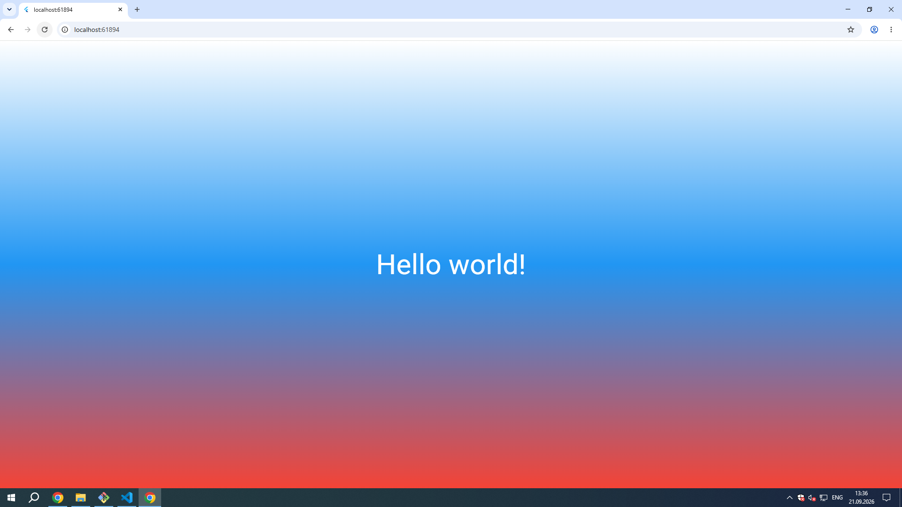

# first_flutter_app

A new Flutter project.

## Getting Started

This project is a starting point for a Flutter application.

A few resources to get you started if this is your first Flutter project:

- [Learn Flutter](https://docs.flutter.dev/get-started/learn-flutter)
- [Write your first Flutter app](https://docs.flutter.dev/get-started/codelab)
- [Flutter learning resources](https://docs.flutter.dev/reference/learning-resources)

For help getting started with Flutter development, view the
[online documentation](https://docs.flutter.dev/), which offers tutorials,
samples, guidance on mobile development, and a full API reference.

# Flutter Lab3 — First Flutter App

Учебное Flutter-приложение, созданное в рамках лабораторной работы №3. Демонстрирует базовые концепции Flutter: виджеты, дерево виджетов, `MaterialApp`, `Scaffold`, `Container` с градиентом и `Text` со стилем.

---

## Автор

- **ФИО:** Игошин Кирилл, Имашев Наиль
- **Группа:** ИСП-242
- **Дата:** 30.09.2026

---

## Стек и версии

| Компонент | Версия |
|-----------|--------|
| Flutter | 3.41.2 (stable) |
| Dart | 3.11.0 |
| Платформа | Web (Chrome) |
| IDE | VS Code |

---

## Скриншот приложения



---

## Запуск

1. Клонировать репозиторий:
   ```bash
   git clone https://github.com/kirill242ISP/Flutter_Lab3.git
   ```
2. Перейти в папку проекта:
   ```bash
   cd Flutter_Lab3
   ```
3. Установить зависимости:
   ```bash
   flutter pub get
   ```
4. Запустить в Chrome:
   ```bash
   flutter run -d chrome
   ```

---

## Что изучили

- **Платформа Flutter** — кроссплатформенный UI-фреймворк от Google, рисует интерфейс собственным движком Skia/Impeller.
- **Виджеты и дерево виджетов** — весь UI строится из вложенных виджетов (`MaterialApp` → `Scaffold` → `Container` → `Center` → `Text`).
- **Точка входа** — `main()` → `runApp()` → `MaterialApp()` → `home:`.
- **Hot Reload vs Hot Restart** — `r` сохраняет состояние, `R` перезапускает приложение с нуля.
- **Стилизация** — `TextStyle`, `BoxDecoration`, `LinearGradient`, `Color`.
- **DevTools и Flutter Inspector** — визуальная инспекция дерева виджетов.

---

## Структура проекта (основное)

```
Flutter_Lab3/
├── lib/
│   └── main.dart          # Основной код приложения
├── web/                   # Точка входа для веб-сборки
├── img/                   # Скриншоты
├── pubspec.yaml           # Манифест проекта
├── .gitignore             # Исключения Git
└── README.md              # Этот файл
```